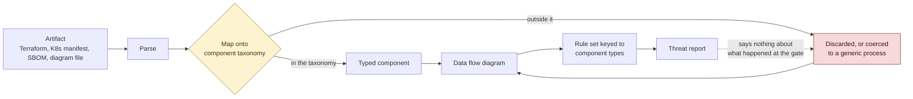
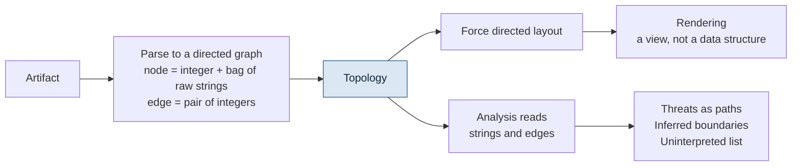
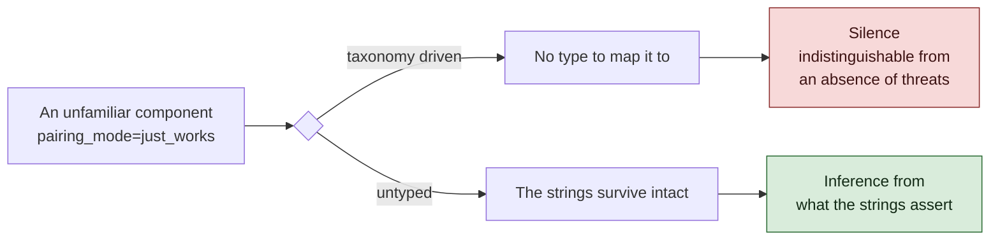
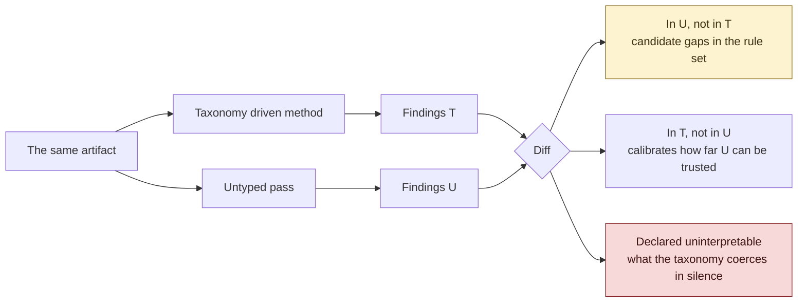

# Automated Threat Modeling Is Bounded by Its Component Taxonomy

Automated threat modeling has converged on a common method. An artifact is parsed, whether a Terraform plan, a Kubernetes manifest, an SBOM or a diagram file. The parsed entities are mapped onto a taxonomy of known component types. A data flow diagram is assembled from those typed components. Threat analysis then runs over the diagram, driven by a rule set keyed to the component types.

The mapping step is usually treated as a parsing convenience. It is the index the entire rule set is keyed against, and it imposes a bound the rest of the method cannot exceed: a component the taxonomy cannot name is a component the rules cannot reach.

This article argues that the bound falls hardest on exactly the components a threat model exists to examine, and that it is unobservable from the output. It describes an untyped alternative, works through the four objections usually raised against such an approach, and proposes a way to measure the bound rather than argue about it.

## Where the bound falls

When a parser encounters an entity outside the taxonomy, one of two things happens. It is discarded, or it is coerced to a generic process and inherits a thin default rule set whose purpose is to avoid returning nothing.



The dotted line is the whole problem. The gate is where coverage is decided, and the report is the only thing anyone reads.

The entities most likely to fall outside a taxonomy are recognisable:

- A cloud service released last quarter
- An internally built platform
- The BLE link between an implantable device and a bedside monitor
- An HL7 interface into a hospital EMR
- A firmware update channel
- Anything inherited through acquisition, running on a stack nobody has modelled

These carry the threats least likely to be enumerated in an existing rule set. Coverage is therefore strongest where it was least needed, and weakest where the analysis was supposed to earn its keep.

## The bound is not visible in the output

An error that announces itself is a manageable problem. This one produces a well formed report with an omission in it, and nothing in the report marks the omission.

The output does not state "fourteen components were identified, three could not be interpreted." It states the threats that were found. A reviewer reads plausible findings and has no basis for distinguishing thorough coverage from thorough coverage of the tractable parts. Silence about a component is indistinguishable from an absence of threats against it.

The conventional response is to extend the taxonomy: define a custom component, write custom rules, maintain both against a moving cloud provider and a moving product. That work is real, it is never complete, and it does not transfer. A rule set developed for a cloud control plane contributes nothing to modelling an embedded device on a hospital network.

## An untyped alternative

Consider a second analysis over the same artifact that performs no mapping at all.

The artifact is parsed into a directed graph and nothing further. A node is an integer and an unordered bag of raw strings, exactly as they appeared in the source. An edge is a pair of integers. There is no type, no class, no taxonomy and no schema.

Nothing is normalised, so nothing is discarded. `aws_s3_bucket`, `acl = "public-read"` and `versioning = false` propagate as strings rather than as fields of a bucket object whose retained properties were chosen in advance by somebody else.

The two functions the data flow diagram was serving can then be separated.



There is no gate. Nothing is discarded on the way in, because nothing was ever selected for keeping.

**For human consumption**, force directed placement over the topology produces a rendering: repulsion between all pairs, attraction along edges, iterated to equilibrium. Placement derives from structure alone. Styling is a set of substring rules over the string bags, so a node whose strings contain `public-read` is drawn in red. The diagram becomes a view rather than a data structure.

**For analysis**, the diagram is skipped and the raw topology passed directly.

```json
{
  "vertices": [0, 1, 2, 3],
  "attributes": {
    "0": ["type=aws_api_gateway", "authorization=NONE", "stage=prod"],
    "1": ["type=aws_lambda_function", "runtime=python3.11", "vpc_config=none"],
    "2": ["type=aws_db_instance", "engine=postgres", "subnet=private"],
    "3": ["type=aws_s3_bucket", "acl=public-read", "versioning=false"]
  },
  "edges": [[0, 1], [1, 2], [1, 3]]
}
```

An unauthenticated gateway reaches a function with no VPC configuration, which reads a private database and writes to an unversioned bucket readable by anyone. That is a complete path from public ingress to data exposure, and nothing was looked up to find it. No table maps `acl=public-read` to a threat, and no rule fired. The strings were read and interpreted in the context of the path they sit on, which is what a reviewer does and what a lookup cannot do: the same string means something different at the end of a chain from a public entry point than it does in isolation.

## Behaviour at the boundary of knowledge

The two approaches differ in how they fail, and that difference is the substance of the argument.

A taxonomy driven method encountering an unfamiliar component **degrades to silence**. An untyped method **degrades to inference from whatever the strings assert**, which is the behaviour of a human reviewer handed an unfamiliar configuration file.



A real extraction, from a six resource Terraform file:

```
5  medical_device_ble_pairing.bedside_monitor
   ['block=resource', 'type=medical_device_ble_pairing',
    'label=bedside_monitor', 'pairing_mode=just_works',
    'firmware=2.1.0', 'uplink=aws_api_gateway_rest_api.public.id']
```

That resource type does not exist in AWS and no provider defines it. A taxonomy driven parser has nothing to map it to. Here it reaches analysis with `pairing_mode=just_works` intact, and any reader of the Bluetooth specifications knows that Just Works pairing provides no man in the middle protection.

Trust boundaries follow from the same mechanism. They are conventionally drawn by hand or inferred from typed constructs, yet `subnet=private`, `namespace=clinical`, `vpc_id=` and `zone=restricted` are already present in the string bags. Boundary crossings are inferable without a boundary type existing anywhere in the representation.

### A second thing falls out, which was not designed for

Reasoning over a path rather than a component finds a class of problem a rule cannot reach at all. From the same run:

> The database is declared private and not publicly accessible, yet its declared accessor runs with `vpc_config=none`, meaning the function has no interface in that private subnet. Either the connection actually traverses a public or otherwise widened path, or the isolation intent is not implemented as written. Reviewers should treat the private-subnet attribute here as documentation rather than an enforced control.

Nothing is wrong with either component considered alone. The database is correctly marked private. The function is a perfectly ordinary function. The finding exists only in the relationship between two vertices, where a declared control is contradicted by the topology around it.

A rule keyed to a component type cannot produce this, because evaluating either component in isolation returns nothing. And the failure it identifies, a control that is documented but not enforced, is among the more consequential things a review can find, since it is precisely the class of problem that survives an audit by looking correct in the artifact.

The bedside monitor above shows the method surviving a component nothing recognises. This one shows it noticing that a component everything recognises is lying.

## How it works

Working code is linked at the end. Around six hundred lines including comments, public domain.

**Extraction is deliberately unintelligent.** For HCL it is brace matching and two regular expressions. Find a block, walk to the matching brace, turn every `key = value` in the body into the string `key=value`. The block type becomes the string `type=aws_s3_bucket`. No lookup table is consulted, because there is not one. Edges are equally plain: if one block's body mentions another block's address, that is an edge.

**Layout is Fruchterman-Reingold** with the standard constants. Ideal edge length `k = sqrt(area / |V|)`, repulsion `k²/d` between every pair, attraction `d²/k` along edges, displacement capped by a temperature starting at `width/10` and annealed by 0.95 per iteration. Seeding the random start deterministically makes a rerun over a changed file diffable rather than reshuffled.

**Styling is a list of substring rules.** A string containing `public-read`, `0.0.0.0/0`, `authorization=NONE` or `just_works` draws red; `encrypted=false` or `tls=false` draws amber. Adding a rule is adding a row. There is no object model to migrate, because there is no object model.

**Analysis has two modes.** The default returns inferred trust boundaries with the strings that justified them, threats expressed as paths rather than per node findings, and a list of components it could not interpret. The second mode enumerates the full grid of vertices against threat categories and is described under the auditability objection below.

That third output of the default mode is not decoration. The charge against taxonomy driven methods is silent under reporting, so any alternative must be measurable on the same axis: it has to be able to state that a component is opaque to it, and why. An empty list over a graph containing something unfamiliar is a worse result than a declared gap.

## Relation to existing work

The weight of published work runs the other way, and it does so for defensible reasons.

For a decade the response to the question of how machines might reason over security data has been to make the type system **more** formal, not less. Bromander, Jøsang and Eian set out [ontology based threat modelling at STIDS in 2016](https://stids.c4i.gmu.edu/papers/STIDSPapers/STIDS2016_A2_BromanderJosangEian.pdf) [1]. OWASP has maintained the [Ontology-Driven Threat Modeling Framework](https://owasp.org/www-project-ontology-driven-threat-modeling-framework/) since, publishing OWL threat models for web, cloud and IoT and integrating them with ATT&CK, CAPEC and CWE [2]. ACM Transactions on Cyber-Physical Systems published [a semantic threat model for cyber-physical systems](https://doi.org/10.1145/3777450) in January 2026 [3]. The direction is consistent and the work is careful.

Recent work applying language models largely preserves that shape. [ASTRAL](https://arxiv.org/abs/2604.05674) uses multimodal models to reconstruct an architecture where documentation is fragmented, then analyses the reconstruction [4]. [SMSI](https://arxiv.org/abs/2604.23905) begins from a SysML model carrying CPE identifiers and applies learned models where natural language requires interpretation [5]. Both place the model in service of building or annotating a typed representation.

The position advanced here is therefore a minority one, and the majority position rests on a sound premise. The 2016 paper is candid about the cost of the taxonomy:

> "The task of extracting semantic features for all levels of abstraction... is an undertaking of daunting proportions. In order to make this task manageable the reuse of related standards and taxonomies is required." [[1]](https://stids.c4i.gmu.edu/papers/STIDSPapers/STIDS2016_A2_BromanderJosangEian.pdf)

And, writing about intrusion detection signatures, explicit about why that cost was unavoidable:

> "TTPs are commonly described using English prose, i.e. as unstructured data. This makes it challenging to translate the description to intrusion detection signatures, and signature development must be performed manually." [[1]](https://stids.c4i.gmu.edu/papers/STIDSPapers/STIDS2016_A2_BromanderJosangEian.pdf)

Together those constitute the rationale for ontologies. Prose could not be acted upon, so it had to be translated into structure first, and that structure had to be constructed and maintained by hand at considerable cost.

The second constraint has since lifted: prose can now be read directly. This does not invalidate a decade of ontology work, which bought real properties at a real price and had no alternative available at the time. It does mean the tradeoff merits re examination, since one side of it has changed and the other has not.

## Four objections

Four objections are usually raised against replacing a rule engine with a model. Each is legitimate, and each has a practical answer. What survives is narrower than the objection itself, and is stated at the end of each.

### Auditability

*A rule engine yields an artifact defensible in a premarket submission: rule set version 4.2, three hundred and forty rules, a record of which fired and which did not. No equivalent comes out of a model.*

Two things are being conflated in this objection: provenance of a finding, and enumeration of what was considered. They have different answers.

**Provenance is stronger here, not weaker.** Every finding cites the exact strings from the source that carry it, so the evidence chain terminates in the configuration itself rather than in an intermediate abstraction. An assessor asking why a conclusion was reached receives the source strings, the file and the commit. That is a shorter chain of custody than a rule identifier which must then be traced back to its own justification. A defensible record is four pinned values: model identifier, prompt hash, topology hash, output. All four are small, diffable and version controllable.

**Enumeration is the harder half, and it is available, but it requires changing what is enumerated.**

A rule engine enumerates over component types crossed with threat patterns. The component type axis is what makes that enumeration open ended and proprietary: three hundred and forty rules is a claim about one vendor's list, not about the space of threats, and the list is unbounded in principle because there is always another component to support.

The threat category axis is different. STRIDE has six categories. LINDDUN has seven. They are closed, published, stable, and above all **independent of component type**: whether a component is subject to spoofing is answerable without knowing what the component is. That independence is what makes them usable here when a component taxonomy is not.

So instead of asking for threats, ask for a decision on every cell of a grid. For each vertex, for each category in a published set, does this category apply, and on what evidence. Fourteen vertices against six STRIDE categories is eighty-four evaluations, every one answered, negatives included with their reasoning.

That artifact is **more** complete than a rule engine's, which reports only the rules that fired and is silent about the rest of its own space. And it is defensible against a published standard rather than against a vendor's inventory, which is the stronger position in a submission.

Note what has and has not been reintroduced. The enumeration runs over **threat categories**, not component types. The component taxonomy stays deleted, which is the claim of this article; a small closed list of threat classes is added on the other axis, and it is one an assessor already recognises.

**What remains** is that the model cannot be proven to have reasoned *well* within a given cell. That is a question of quality rather than completeness, and it is the same question asked of a human led threat model, where the audit standard has always been documented consideration rather than demonstrated cognition. It is a real limitation and it is not a novel one.

### Reproducibility

*A change of model version or prompt means last quarter's threat model no longer regenerates.*

This objection assumes regeneration is the requirement. It is not. A threat model is a document under version control, and the requirement is that a re-run reports what changed and why, which is achievable without determinism.

Pin the model identifier and the prompt hash alongside the stored output. On re-run, three things can change: the artifact, the prompt or the model. Each is independently pinned, so any delta is attributable. Holding the model and prompt fixed and changing the artifact yields exactly the diff a reviewer wants. Holding the artifact fixed and moving the model version yields a calibration measurement.

Nobody re-executes a rule engine from 2019 to defend a 2019 assessment either. The stored report is the artifact, and its provenance is what matters. The same discipline applies here, with the addition that the model version becomes part of the provenance record rather than an unstated assumption, which is arguably an improvement over rule engines whose version histories are often reconstructed after the fact.

**What remains** is that bit for bit regeneration is not available, and one dependency is outside the operator's control: a pinned model identifier may be retired by its provider, at which point the original run cannot be reproduced at all. A rule engine pinned to a container image does not have that exposure. Anyone relying on long horizon reproducibility should archive the outputs rather than assume the ability to regenerate them.

### Recall

*An untyped approach under generates and produces silence, and recall cannot be measured against unknown ground truth.*

Recall against unknown ground truth is unmeasurable for a rule engine too, which is the entire argument of this article. The relevant question is whether it can be estimated, and four methods are available without ground truth:

1. **Differential measurement.** The diff against a rule engine, set out in the next section, gives recall relative to a known baseline in both directions.
2. **Self consistency.** Run the analysis repeatedly over an unchanged topology and take the union. Findings appearing in one run of five are a direct signal about stability, and the variance across runs is itself an estimate of how much is being missed on any single pass.
3. **Seeded corpora.** Inject known vulnerable configurations into a topology and measure detection. Ground truth is unknown for real estates but entirely known for a seeded one, and a detection rate over a seeded corpus is a conventional benchmark.
4. **Cross model agreement.** Run an unchanged topology through models from different families and different training corpora. These are closer to independent estimators than repeated runs of a single model, which share a prior and will therefore share blind spots. A finding surfaced by one family and missed by two others is a different signal from one that merely varies between runs of the same model, and the union across families is a tighter lower bound than the union within one.

The declared uninterpreted list does the remaining work by converting silence into a stated gap, which is the property a rule engine lacks and the reason it was made a required output rather than an optional one.

**What remains** is that all four methods measure recall relative to something: a baseline, a prior run, a seeded set, or another model. None yields absolute recall against the true threat space, which no method possesses. Self consistency in particular measures stability rather than correctness, and a model that is consistently wrong will look stable. These are estimates that bound the problem, not measurements that close it.

### Scale

*Edge lists consume context. A few thousand edges is workable; a real infrastructure estate is not.*

Two developments and one observation resolve this.

Context windows have grown by orders of magnitude, and the arithmetic has moved with them. A vertex with a dozen attribute strings costs on the order of a hundred tokens, so ten thousand vertices with their edges sits comfortably inside a current window. The threshold at which this objection binds has moved, and continues to.

Beyond that threshold the graph partitions naturally, and along the lines the analysis already needs. Threats in this formulation are **paths**, so the unit of analysis is a path from an entry point rather than the whole estate. Enumerate ingress vertices, walk outward to bounded depth, and analyse each reachable subgraph. Nothing about a component on the far side of an estate with no path to it changes the analysis of a component here.

The boundary inference provides a second partitioning for free. Once vertices are grouped by inferred boundary, per boundary analysis plus explicit treatment of crossings covers the graph with subgraphs that are individually small. Hierarchical summarisation, where an analysed subgraph collapses to a single vertex carrying an aggregated string bag, extends the same idea upward.

**What remains** is engineering rather than conception: somebody has to build the partitioning, and a naive implementation that sends the whole estate in one request will fail on a real one.

## A proposed measurement

The claim advanced here is empirical and should be treated as such. Rather than replacing a taxonomy driven method, run both over the same artifact and diff the results.



**The diff is the measurement.** Threats surfaced by the untyped pass on which no rule fired are candidate gaps in the rule set. Threats the rules surfaced and the untyped pass missed calibrate how far the latter can be trusted. Components the untyped pass declares uninterpretable identify what the taxonomy is currently coercing to a generic type in silence.

Across a few dozen architectures the diff characterises where a taxonomy is blind. That information is not otherwise obtainable, because a taxonomy cannot report on what it does not contain.

The systems where the gap should be widest are those where being wrong costs most: the acquisition nobody has modelled, the medical device, the internal platform with no established rule set behind it.

## Implementation

[`github.com/jacobbarkai/untyped-threat-modeling`](https://github.com/jacobbarkai/untyped-threat-modeling). CC0, public domain, no attribution required.

```bash
git clone https://github.com/jacobbarkai/untyped-threat-modeling
cd untyped-threat-modeling

# Deterministic. No provider, no key, no SDK required.
python untyped_threat_model.py --iac sample.tf --extract-only

# Configure a provider in .env, then:
python untyped_threat_model.py --iac main.tf --svg out.svg
python untyped_threat_model.py --code app.py
python untyped_threat_model.py --image whiteboard.jpg
python untyped_threat_model.py --iac main.tf --audit
```

**The provider is configuration, not architecture.** `LLM_PROVIDER=anthropic` uses that SDK; anything else speaks the OpenAI `/v1/chat/completions` protocol, so a base URL, a key and a model name reach OpenAI, DeepSeek, xAI, Mistral, Groq, OpenRouter, and a local Ollama or vLLM instance. Structured output is requested as `json_schema`, falls back to `json_object`, then to a prompt instruction, so a provider supporting none of the three still works with weaker guarantees.

That portability is not only a convenience. A method that depends on one vendor's model is a product; a method that runs on a local Llama and on a frontier API is a method, and the difference matters for anyone who cannot send infrastructure descriptions to a third party. It also makes the approach testable by people with no budget, which is a precondition for the measurement proposed above being carried out by anyone other than its author.

The `--audit` flag implements the enumeration described under the auditability objection: every vertex against every STRIDE category, negatives reported alongside positives with the evidence that decided each. The expected cell count is computed from the topology and checked against what came back, so a short return is reported as an incomplete artifact rather than passed off as a clean one.

Extraction, layout and rendering require no API key and no SDK, which is what `--extract-only` exposes; only the analysis step calls a model. The parser can therefore be run over real infrastructure and the resulting topology inspected before any provider is configured or anything leaves the machine.

No component of this architecture is new. Force directed layout is [Fruchterman and Reingold, 1991](https://doi.org/10.1002/spe.4380211102) [6]. Schema free property graphs are [Neo4j](https://neo4j.com/docs/getting-started/appendix/graphdb-concepts/) and [RDF](https://www.w3.org/RDF/). Styling decoupled from structure is what [Graphviz DOT attributes](https://graphviz.org/doc/info/attrs.html) have done since the nineties. What changed is that interpretation of the strings no longer has to be performed by code, which was not previously an option.

Results from anyone running the diff against real infrastructure would be of interest, particularly negative ones.

## References

[1] Bromander, S., Jøsang, A., Eian, M. "Semantic Cyberthreat Modelling." *STIDS 2016* (Semantic Technology for Intelligence, Defense, and Security), pp. 74-78. Quotations above are from its concluding section. https://stids.c4i.gmu.edu/papers/STIDSPapers/STIDS2016_A2_BromanderJosangEian.pdf

[2] OWASP Ontology-Driven Threat Modeling Framework (OdTM), project lead Andrei Brazhuk. Base Threat Model and domain models for cloud, web and IoT in OWL, integrated with ATT&CK, CAPEC and CWE. https://owasp.org/www-project-ontology-driven-threat-modeling-framework/

[3] "A Semantic Threat Model to Evaluate Security Threats in Cyber-Physical Systems." *ACM Transactions on Cyber-Physical Systems*, 20 January 2026. https://doi.org/10.1145/3777450

[4] Huang, S., Poskitt, C. M., Shar, L. K. "From Incomplete Architecture to Quantified Risk: Multimodal LLM-Driven Security Assessment for Cyber-Physical Systems" (ASTRAL). arXiv:2604.05674, April 2026. https://arxiv.org/abs/2604.05674

[5] "SMSI: System Model Security Inference: Automated Threat Modeling for Cyber-Physical Systems." arXiv:2604.23905, April 2026. https://arxiv.org/abs/2604.23905

[6] Fruchterman, T. M. J., Reingold, E. M. "Graph Drawing by Force-Directed Placement." *Software: Practice and Experience*, 21(11), pp. 1129-1164, 1991. https://doi.org/10.1002/spe.4380211102

---

**Archived record:** [10.5281/zenodo.22100345](https://doi.org/10.5281/zenodo.22100345) (concept DOI, latest version). Code and article: [github.com/jacobbarkai/untyped-threat-modeling](https://github.com/jacobbarkai/untyped-threat-modeling). CC0.
